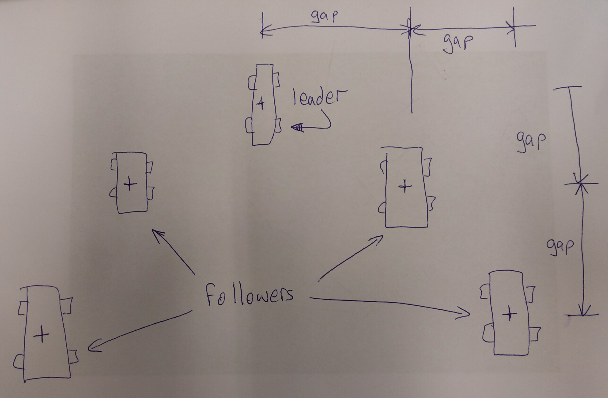

# Games Engines 2 Lab Test 2018

## Instructions
This is a video of what your project should look like at the end of today's lab test:

[](https://www.youtube.com/watch?v=bydalDzhCBY)

You will have to make a prefab for the Eagle ship and make a spawner component that instiantiates formations of Eagles

- Download [this starter Unity project](https://github.com/skooter500/GE2-Labtest1-2018/blob/master/Space1999.zip?raw=true) that has a skybox asset and a model of the Eagle transporter ship.
- Create a new, Unity project on github. Name it Space1999 and push your project to it. You can use whatever git client you are familiar with, but if you are not sure how to do this, cd to the folder you unzipped the project to and type:

    ```bash
    git init
    git remote add origin PASTE_THE_REPO_URL_FROM_YOUR_BROWSER_HERE
    git pull origin master
    git add .
    git commit -m "Initial version"
    git push --set-upstream origin master
    ```
- Create a new empty scene in your Unity project
- Set up the skybox and position the camera at (42, 8, -45), with a rotation of 83<sup>o</sup> around the Y axis. (To set the skybox, set the skybox material from Window | Lighting)
- Drag the Eagle model into the scene. Delete the camera gameObject from the model. It's called Cinema_4D_Editor in the hierarchy. Rotate it so that it points down the Z azis and parent it to an empty gameobject called eaglePrefab.
- Add a new component called Boid to the eaglePrefab. Give the Boid public fields for mass and maximumSpeed. Give these the values of 1 and 10. Later you will write behaviours and an integration method.
- Make a prefab out of the Eagle ship and remove it from the scene.
- Make an empty GameObject called eagleSpawner and give it a position of (93, 3, -5) and a Y rotation of -116<sup>o</sup>
- Add a new EagleSpawner component to the eagleSpawner gameObject. Give it the following fields:

    ```C#
    public float gap = 20;
    public float followers = 2;
    public GameObject prefab;
    ```
- Write code in the Awake method of the EagleSpawner to spawn a fleet of Eagles in a "V pattern" around the position of the eagleSpawner game object. The variable ```gap``` is used to set the gap between each of the Eagles on the X and Z axis. ```followers``` is used to set the number of eagles to spawn each side of the leader. For example a value of 2 means 2 followers each side of the leader, meaning 5 Eagles in total. Drag the Eagle prefab you made earlier to the prefab gameObject. The diagram below shows how the eagles should be spawned. This script needs to work correctly even if the eagleSpawner is rotated, which it is.



- Dynamically assign a Seek behaviour to the leader of the fleet so that it seeks a target 1000 units in front of itself.
- Dynamically assign an Offset Pursue behaviour to the followers of the leader so that they try and stay in formation with the leader.
- You will have to code these behaviours and write an integration function for the Boid class you made earlier. You can use a rigidBody for the integration if you can get it working or use any of the other techniques you learned on the course to implement these behaviours.
- Make the camera look at the leader of the formation.

To get full marks you should use game components and draw useful gizmos

[Submit your repo link here](https://docs.google.com/forms/d/e/1FAIpQLScYLzCt6HRRMQnAAAm2On9IiWaIrWxM6bvjCbNDbbRf_GNLIQ/viewform).
    
## Marking scheme

| Feature | Marks |
|---------|-------|
| Setting up the scene with the skybox, camera, prefab & spawner | 10 marks |
| Writing the EagleSpawner behaviour | 30 marks |
| Implement the Leader behaviour | 20 marks |
| Implement the Follower behaviour | 30 marks |
| Camera following | 10 marks |
